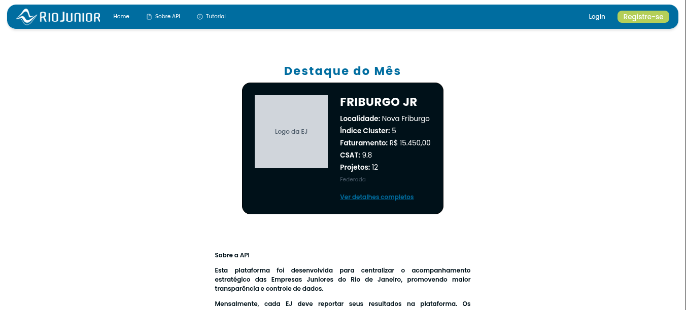

# Dashboard RioJunior
Sistema desenvolvido para centralizar o acompanhamento estratégico das Empresas Juniores (EJs), promovendo transparência e controle de dados para a Federação.
A plataforma permite que as EJs reportem mensalmente seus resultados (faturamento, projetos, CSAT, etc.) e visualizem rankings, destaques e históricos de desempenho.

## Funcionalidades

Autenticação: Login e Registro de empresas com criptografia de senha.

Dashboard Administrativo: A Federação tem acesso a todos os dados de todas as EJs.

Lançamento de Resultados: Formulário mensal automatizado (trava de mês vigente).

Ranking e Destaque: Exibição automática da EJ com melhor performance (Cluster, Faturamento, etc.).

Busca e Filtros: Pesquisa de EJs por nome, cidade ou status de federação.

Perfil Público/Privado: Visualização detalhada do histórico de cada empresa.

## Backend (API)

Node.js & Fastify

Prisma: Interação com o banco de dados.

MySQL: Banco de dados.

Zod: Validação de dados.

JWT (JSON Web Token): Autenticação.

## Frontend (Web)

React + Vite: Desenvolvimento.

TypeScript: Segurança de tipagem.

Tailwind CSS: Estilização moderna e responsiva.

Shadcn/UI: Componentes de interface acessíveis e elegantes.

Lucide React: Ícones.
